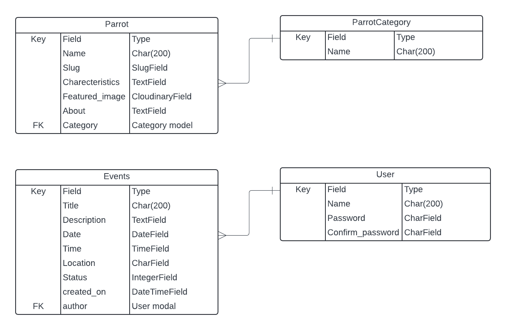

# What's ParrotHub!

Click the link to view the live app [ParrotHub](https://parrot-hub-ea31d979dcf4.herokuapp.com/)

ParrotHub is your go-to platform for discovering upcoming parrot-related events and accessing detailed information about various parrot species. Whether you're interested in attending parrot exhibitions, workshops, or seminars, ParrotHub keeps you informed about the latest events in the parrot community. Additionally, ParrotHub offers comprehensive details about different parrot species, including their characteristics, behaviors, and care requirements. Join us to stay updated on parrot events and explore the fascinating world of parrots.

# ParrotHub Project Aims

The aims of the ParrotHub website project are as follows:

1. **Event Discovery**: Provide a centralized platform for users to discover upcoming parrot-related events, including exhibitions, workshops, seminars, and conservation initiatives.

2. **Species Information**: Offer comprehensive information about various parrot species, including their characteristics, habitat, diet, behavior, and conservation status, to educate and empower users in their understanding and appreciation of these birds.

3. **Education and Awareness**: Promote parrot welfare, responsible ownership, and conservation efforts by sharing educational resources, articles, and news updates related to parrots and their ecosystems.

4. **User-Friendly Experience**: Ensure a seamless and intuitive user experience through a well-designed and responsive website layout, easy navigation, and accessible content presentation.

5. **Partnerships**: Establish partnerships with parrot-related organizations, businesses, and experts to enhance the platform's credibility, expand its reach, and provide users with valuable resources and opportunities.
   
## How to Use ParrotHub

### 1. Discover Parrot Species
- Explore comprehensive information about various parrot species directly on the homepage of ParrotHub.
- Upon visiting the website, you will be automatically directed to the homepage, where you can access detailed profiles of different parrot species.
- Discover key details about each species, including characteristics, habitat, diet, behavior, and conservation status, all conveniently available from the main landing page.

### 2. Learn More About Parrots
- Click the "Learn More" button to delve deeper into the world of parrots and expand your knowledge.
- Explore articles, resources, and additional information curated to help users learn more about parrot care, behavior, training, and conservation efforts.
- Access educational content and valuable insights to enhance your understanding and appreciation of these fascinating birds.

### 3. Explore Events
- Sign in to your ParrotHub account to access the "Events" section and explore upcoming parrot-related events.
- If you don't have an account yet, you can easily create one by clicking on the "Sign Up" option and providing the required information.
- Once logged in, you can browse through a curated list of upcoming events, including exhibitions, workshops and seminars.

### 4. Admin Event Management
- Admin users can create new events by clicking the "Add Event" button. Upon clicking, they will be redirected to a form where they can input details about the event.
- After submitting the form, admin users will be redirected to the events page where the newly added event will be visible among others.
- Each event card on the events page will have two additional buttons: "Delete" and "Update Event".
- Admin users can click the "Update" button to open a modal where they can update the details of the event.
- Admin users can click the "Delete" button to delete the event.
- This streamlined process enables admin users to efficiently manage events, ensuring that the platform remains up-to-date and relevant to the community.

### 5. Stay Informed
- Stay informed about the latest posts and updates by regularly checking the platform for new content and announcements.
  
# User Stories & Epics
All user stories were entered as issues in a GitHub Kanban project follow the link to see the project:
[Project Link](https://github.com/users/zohaibshahzadkhan/projects/4)

### Epic 1: Displaying Parrots and Individual Parrot Detail Info.
- [1](https://github.com/zohaibshahzadkhan/ParrotHub/issues/1) - As a parrot enthusiast, I want to discover information about different parrot species, so that I can select the parrot and learn about it's characteristics .
- [2](https://github.com/zohaibshahzadkhan/ParrotHub/issues/2) - As a user, I want to access detailed information about individual parrots, so that I can learn about specific species and their unique traits

### Epic 2: Authentication.
- [8](https://github.com/zohaibshahzadkhan/ParrotHub/issues/8) - As a Site User I can register an account so that I can view Events.

### Epic 3: Event Management.
- [9](https://github.com/zohaibshahzadkhan/ParrotHub/issues/9) - As a general user, I want to view event details, so that I can attend events.
- [5](https://github.com/zohaibshahzadkhan/ParrotHub/issues/5) - As an admin, I want to post details about upcoming parrot-related events, so that I can inform the community and encourage participation.
- [7](https://github.com/zohaibshahzadkhan/ParrotHub/issues/7) - As an admin user , I want to delete event details about upcoming parrot-related events, so that I can manage events effectively.
- [6](https://github.com/zohaibshahzadkhan/ParrotHub/issues/6) - As an admin, I want to update event details about upcoming parrot-related events, so that I can keep the information accurate and up-to-date.

### Incomplete User Stories for future developement
- [3](https://github.com/zohaibshahzadkhan/ParrotHub/issues/3) - As a general user, I want to view event details and comment on events, so that I can engage with the community and express interest in attending.
- [4](https://github.com/zohaibshahzadkhan/ParrotHub/issues/4) - As a Site User I can modify or delete my comment on a Event so that I can be involved in the conversation.

## Design
### ERD

