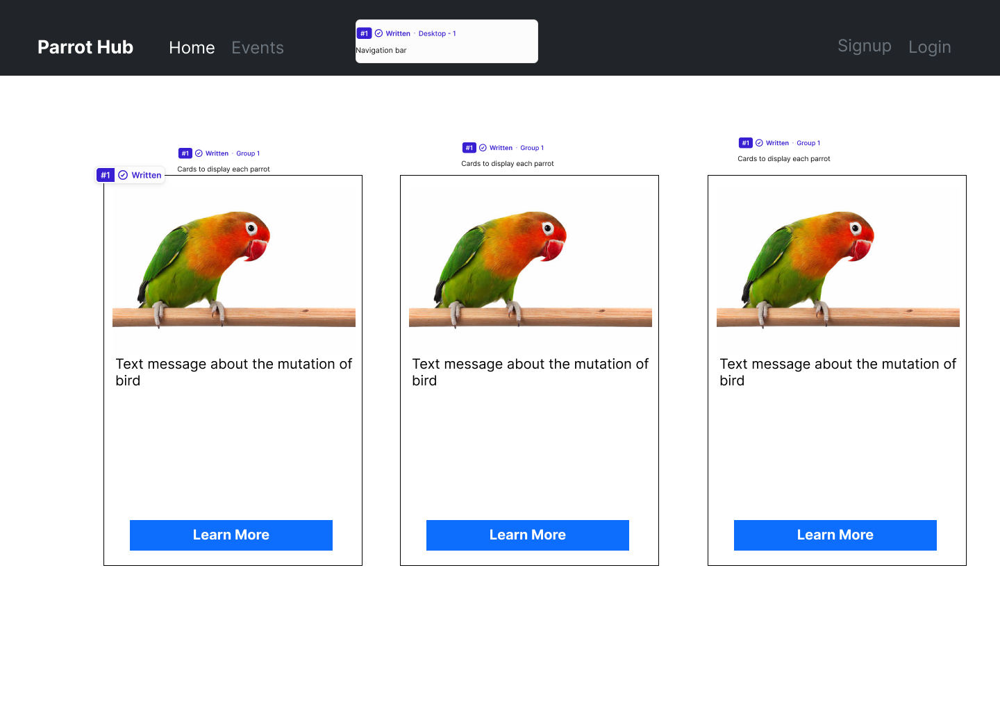

# What's ParrotHub!

Click the link to view the live app [ParrotHub](https://parrot-hub-ea31d979dcf4.herokuapp.com/)

ParrotHub is your go-to platform for discovering upcoming parrot-related events and accessing detailed information about various parrot species. Whether you're interested in attending parrot exhibitions, workshops, or seminars, ParrotHub keeps you informed about the latest events in the parrot community. Additionally, ParrotHub offers comprehensive details about different parrot species, including their characteristics, behaviors, and care requirements. Join us to stay updated on parrot events and explore the fascinating world of parrots.

# ParrotHub Project Aims

The aims of the ParrotHub website project are as follows:

1. **Event Discovery**: Provide a centralized platform for users to discover upcoming parrot-related events, including exhibitions, workshops, seminars, and conservation initiatives.

2. **Species Information**: Offer comprehensive information about various parrot species, including their characteristics, habitat, diet, behavior, and conservation status, to educate and empower users in their understanding and appreciation of these birds.

3. **Education and Awareness**: Promote parrot welfare, responsible ownership, and conservation efforts by sharing educational resources, articles, and news updates related to parrots and their ecosystems.

4. **User-Friendly Experience**: Ensure a seamless and intuitive user experience through a well-designed and responsive website layout, easy navigation, and accessible content presentation.

5. **Partnerships**: Establish partnerships with parrot-related organizations, businesses, and experts to enhance the platform's credibility, expand its reach, and provide users with valuable resources and opportunities.
   
## How to Use ParrotHub

### 1. Discover Parrot Species
- Explore comprehensive information about various parrot species directly on the homepage of ParrotHub.
- Upon visiting the website, you will be automatically directed to the homepage, where you can access detailed profiles of different parrot species.
- Discover key details about each species, including characteristics, habitat, diet, behavior, and conservation status, all conveniently available from the main landing page.

### 2. Learn More About Parrots
- Click the "Learn More" button to delve deeper into the world of parrots and expand your knowledge.
- Explore articles, resources, and additional information curated to help users learn more about parrot care, behavior, training, and conservation efforts.
- Access educational content and valuable insights to enhance your understanding and appreciation of these fascinating birds.

### 3. Explore Events
- Sign in to your ParrotHub account to access the "Events" section and explore upcoming parrot-related events.
- If you don't have an account yet, you can easily create one by clicking on the "Sign Up" option and providing the required information.
- Once logged in, you can browse through a curated list of upcoming events, including exhibitions, workshops and seminars.

### 4. Admin Event Management
- Admin users can create new events by clicking the "Add Event" button. Upon clicking, they will be redirected to a form where they can input details about the event.
- After submitting the form, admin users will be redirected to the events page where the newly added event will be visible among others.
- Each event card on the events page will have two additional buttons: "Delete" and "Update Event".
- Admin users can click the "Update" button to open a modal where they can update the details of the event.
- Admin users can click the "Delete" button to delete the event.
- This streamlined process enables admin users to efficiently manage events, ensuring that the platform remains up-to-date and relevant to the community.

### 5. Stay Informed
- Stay informed about the latest posts and updates by regularly checking the platform for new content and announcements.
  
# User Stories & Epics
All user stories were entered as issues in a GitHub Kanban project follow the link to see the project:
[Project Link](https://github.com/users/zohaibshahzadkhan/projects/4)

### Epic 1: Displaying Parrots and Individual Parrot Detail Info.
- [1](https://github.com/zohaibshahzadkhan/ParrotHub/issues/1) - As a parrot enthusiast, I want to discover information about different parrot species, so that I can select the parrot and learn about it's characteristics .
- [2](https://github.com/zohaibshahzadkhan/ParrotHub/issues/2) - As a user, I want to access detailed information about individual parrots, so that I can learn about specific species and their unique traits

### Epic 2: Authentication.
- [8](https://github.com/zohaibshahzadkhan/ParrotHub/issues/8) - As a Site User I can register an account so that I can view Events.

### Epic 3: Event Management.
- [9](https://github.com/zohaibshahzadkhan/ParrotHub/issues/9) - As a general user, I want to view event details, so that I can attend events.
- [5](https://github.com/zohaibshahzadkhan/ParrotHub/issues/5) - As an admin, I want to post details about upcoming parrot-related events, so that I can inform the community and encourage participation.
- [7](https://github.com/zohaibshahzadkhan/ParrotHub/issues/7) - As an admin user , I want to delete event details about upcoming parrot-related events, so that I can manage events effectively.
- [6](https://github.com/zohaibshahzadkhan/ParrotHub/issues/6) - As an admin, I want to update event details about upcoming parrot-related events, so that I can keep the information accurate and up-to-date.

### Incomplete User Stories for future developement
- [3](https://github.com/zohaibshahzadkhan/ParrotHub/issues/3) - As a general user, I want to view event details and comment on events, so that I can engage with the community and express interest in attending.
- [4](https://github.com/zohaibshahzadkhan/ParrotHub/issues/4) - As a Site User I can modify or delete my comment on a Event so that I can be involved in the conversation.

# Design
### ERD

# Wireframes

### Home Page

### Home/Parrot Page

### Events Page

### Add Event Page

### Update Event Modal

### Navigation Plan

# Features

### 1. User Authentication
- Sign up for a new account
- Log in securely to access your account
- Display success messages upon successful login or registration

### 2. Parrot Listings
- Browse list of parrots
- View main information about parrots

### 3. Individual Parrot Page
- Explore dedicated pages for each parrot, showcasing images, and in-depth descriptions
- Learn about specific species and their unique traits

### 4. Event Management
- Stay updated on upcoming events for parrot enthusiasts, including meetups, adoption drives, and educational workshops

- Admin users can add, update, and delete events to keep the community informed

# Future Features

### 1. Commenting on Events
- Registered users will be able to comment on event posts, sharing their thoughts, experiences, and questions.

### 2. Parrot Addition Requests
- Users can request to add parrots to the parrot list. After admin approval, the parrot details will be shown on the site.

### 3. User Parrot Details
- Users can add details of their own parrots for record-keeping purposes, allowing them to track and manage information about their feathered friends.

# Technologies Used

- HTML5
- CSS3
- Python
- Javascript
- cloudinary
- django-allauth
- django-summernote
- Bootstrap
- PostgreSQL

***

# Testing 

A separate testing document has been created as [Testing.md](Testing.md)

### Known - Bug

Event card layout is getting off when long text has been provided in location field. This is a known bug. However it can not be fixed due to time constraint.

#### Solution 

Use CSS grid/flex-box system and restructure layout to move button vertically under location paragraph.

***

## Deployment
### Cloning & Forking
#### Fork
1. On GitHub.com, navigate to the [zohaibshahzadkhan/ParrotHub](https://github.com/zohaibshahzadkhan/ParrotHub) repository.
2. In the top-right corner of the page, click Fork.
3. By default, forks are named the same as their parent repositories. You can change the name of the fork to distinguish it further.
4. Add a description to your fork.
5. Click Create fork.

#### Clone
1. Above the list of files click the button that says 'Code'.
2. Copy the URL for the repository.
3. Open Terminal. Change the directory to the location where you want the cloned directory.
4. Type git clone, and then paste the URL
5. Press Enter.

### Local Deployment
1. On GitHub.com, navigate to the [zohaibshahzadkhan/ParrotHub](https://github.com/zohaibshahzadkhan/ParrotHub) repository and clone it.
2. Once you clone the repository you will need to install the libraries, you can do this by typing "pip3 install -r requirements.txt" into the terminal
3. Open the .env file in the project directory and change the key pair values to match your credentials. There is a [sample env file](/sample_env.py) that you can use to help you

### Remote Deployment 
1. Log in to Heroku
2. Click 'Create new app'.
3. Give your application a unique name, select a region appropriate to your location and click the 'Create app' button.
4. You can use an external database for example postgre or use 'Heroku Postgres' under the Add-ons section.
5. Go to settings section and click 'Reveal Config Vars' in the Config vars section.
6. Add ALLOWED_HOSTS and the value as the name of you project with '.herokuapp.com' appended to the end.
7. Add CLOUDINARY_URL and the value as your cloudinary API key.
8.  Add SECRET_KEY and the value as a complex string which will be used to provide cryptographic signing.
9.  Add DATABASE_URL if you are using a different database than Heroku Postgres.
10. Navigate to the 'Deploy' page
11. Select 'GitHub' from the 'Deployment method' section
12. Enter your github account details and select the forked/ clone repository.
13. Select 'Manual deploy', select the 'main' branch in the drop down and click the 'Deploy' button.
14. Once built, click the 'View' button to load the URL.

### Database
A Postgres database has been used for this project, provided by ElephantSQL.

1. Open your web browser and go to the [ElephantSQL](https://www.elephantsql.com/) website.
2. Sign up for a free account or log in if you already have an account.
3. Once you have logged in, you will be taken to the Dashboard. From here, click on the "Create New Instance" button.
4. You will now be taken to a page where you can configure your new database instance. Choose the "Tiny Turtle" plan which is free.
5. Select the region where you want to host your database. The closest region to you is usually the best choice.
6. Choose a name for your instance, this will be the name of your database.
7. Choose a username and password for your instance.
8. Click on the "Create" button to create your new database instance.
1. The database url was stored in a config var: 'DATABASE_URL' on Heroku. This variable was then used in the settings.py to connect to the database.
10. Click on the "Details" tab to view your instance details.
11. Look for the "URI" field, which contains the connection details you need to connect to your database. The URI should start with: 'postgres://'

The models were migrated to the database by entering the following commands in the terminal:

python3 manage.py makemigrations
python3 manage.py migrate

 The live link can be found here - [Parrothub](https://parrot-hub-ea31d979dcf4.herokuapp.com/)

### Prerequisite
- A Cloudinary account will be needed, create one for free at https://cloudinary.com.

***

## Credits

- There has been useful guidance from various articles from Stack Overflow - [Stack Overflow ](https://stackoverflow.com/)

- HTML, CSS and Javascript code help was taken from w3schools - [W3Schools](https://www.w3schools.com/)

- Django Documentation - [Django](https://docs.djangoproject.com/en/4.1/)

- Bootstrap Documentation - [Bootstrap](https://getbootstrap.com/docs/5.3/getting-started/introduction/)

- Lucid Chart - This helped me to design my flow charts and class diagrams - [Lucid Chart](https://lucid.app/)

- Figma - This helped me to design my wire-frames - [Figma](https://www.figma.com/)

#### Media
- Google Image - [google image](https://google.com/)
  

## Acknowledgements
I want to express my immense gratitude to Code Institute for their Django course. Throughout this program, I've gained valuable knowledge that has been instrumental in developing this application.
