# ParrotHub

[<< Back to ReadMe](Readme.md)

## Automated Tests

I have 15 tests with 96% coverage of my code.

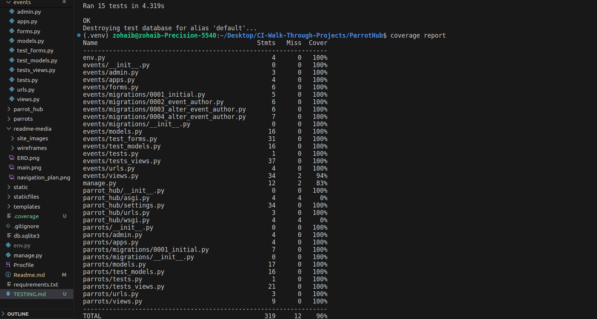

***

# ParrotHub - Manual Testing

Welcome to the manual testing documentation for ParrotHub. This document outlines the various tests conducted to ensure the functionality and quality of the ParrotHub platform.

## Feature 1: User Authentication

| Test | Description | Expected Outcome | Result |
|------|-------------|------------------|--------|
| 1    | Valid Credentials | Log in with valid username and password. | User is successfully logged in and redirected to the dashboard. |
| 2    | Invalid Credentials | Log in with invalid username and/or password. | User receives an error message indicating invalid credentials. |
| 3    | Account Registration | Register a new account with valid information. | User account is successfully created and can be used for login. |

## Feature 2: Parrot Listings

| Test | Description | Expected Outcome | Result |
|------|-------------|------------------|--------|
| 1    | View Parrot Listings | Navigate to the Home page. | A list of available parrots is displayed with relevant information. |
| 2    | Read more information of specific parrot | Click on Learn More | Detailed information about the selected parrot is displayed, including images and text. |

## Feature 3: Event Management

| Test | Description | Expected Outcome | Result |
|------|-------------|------------------|--------|
| 1    | Login as registered user to view Event Listings | Navigate to the events page. | A list of upcoming events is displayed with relevant information such as title, date, and location. |
| 2    | Add New Event (Admin) | Log in as an admin user and add a new event. | The new event is added to the list of upcoming events and is visible to all users, A success message is displayed. |
| 4    | Update Event Details (Admin) | Log in as an admin user and update event details. | The changes to event details are reflected and visible to all users, A success message is displayed. |
| 5    | Delete Event (Admin) | Log in as an admin user and delete an event. | The event is removed from the list of upcoming events and is no longer visible to users. A success message is displayed. |

## Feature 4: Welcome Modal

| Test | Description | Expected Outcome | Result |
|------|-------------|------------------|--------|
| 1    | Display Welcome Modal | Visit the ParrotHub site for the first time | A welcome modal window is displayed to the user |
| 2    | Automatic Closure | Wait for 10 seconds after the modal appears | The welcome modal automatically closes after 10 seconds |

## Future Features

| Test | Description | Expected Outcome | Result |
|------|-------------|------------------|--------|
| 1    | Comment on Event | Log in as a registered user and comment on an event. | The comment is successfully posted and visible to other users. |
| 2    | Request Parrot Addition | Log in as a registered user and request to add a new parrot. | The request is submitted and pending admin approval. |
| 3    | Add Parrot Details | Log in as a registered user and add details of own parrots. | The parrot details are successfully added to the user's profile for record-keeping. |

## Manual Tests JS / script.js

## Form Validation

### Valid Form Submission

- **Description**: Submit a form with all fields filled correctly.
- **Expected Outcome**: Form submits successfully without any validation errors.

### Invalid Form Submission

- **Description**: Submit a form with one or more fields empty or invalid.
- **Expected Outcome**: Form submission is prevented, and validation errors are displayed for the empty or invalid fields.

## Welcome Message Modal

### Display Welcome Message Modal

- **Description**: Open the ParrotHub site for the first time.
- **Expected Outcome**: A modal with a welcome message for ParrotHub is displayed.

### Close Welcome Message Modal

- **Description**: Wait for 10 seconds after the welcome message modal appears.
- **Expected Outcome**: The welcome message modal automatically closes after 10 seconds.

### Prevent Repeated Display

- **Description**: Refresh the page or revisit the site.
- **Expected Outcome**: The welcome message modal does not appear again during the same session.

### Cookie Set

- **Description**: Check the browser's cookies.
- **Expected Outcome**: A cookie named "parrothub_welcome_shown" with the value "true" is set after the welcome message modal is closed.
  

# ParrotHub - User Story Testing

## User Authentication

### Test Cases

1. **Sign Up for an Account**
   - **Description**: Fill out the sign-up form with valid information and submit.
   - **Expected Outcome**: User account is created successfully, and the user is redirected to the dashboard. (**Pass**)

1. **Log In with Valid Credentials**
   - **Description**: Enter valid username and password in the login form and submit.
   - **Expected Outcome**: User is logged in successfully and redirected to the dashboard. (**Pass**)

2. **Log In with Invalid Credentials**
   - **Description**: Enter invalid username and/or password in the login form and submit.
   - **Expected Outcome**: Authentication fails, and an error message is displayed indicating invalid credentials. (**Pass**)

3. **Log Out**
   - **Description**: Click on the log out  link.
   - **Expected Outcome**: User session is terminated, and the user is redirected to the home page. (**Pass**)

## User Story 2: Browse Parrot Listings

### Test Cases

1. **Parrot Listing Display**
   - **Description**: Navigate to the home  page.
   - **Expected Outcome**: A list of available parrots is displayed, showing relevant information. (**Pass**)

2. **Click on Learn More button**
   - **Description**: Click on a Learn More specific parrot in the listings to view its details.
   - **Expected Outcome**: Detailed information about the selected parrot is displayed, including images and text. (**Pass**)

## User Story 3: Admin Event Management

### Test Cases

1. **Add New Event**
   - **Description**: Log in as an admin user and add a new event.
   - **Expected Outcome**: The new event is added to the list of upcoming events and is visible to all users. (**Pass**)

2. **Update Event Details**
   - **Description**: Log in as an admin user and update event details.
   - **Expected Outcome**: The changes to event details are reflected and visible to all users. (**Pass**)

3. **Delete Event**
   - **Description**: Log in as an admin user and delete an event.
   - **Expected Outcome**: The event is removed from the list of upcoming events and is no longer visible to users. (**Pass**)

## Code Validation

### HTML

#### index
https://validator.w3.org/nu/?doc=https%3A%2F%2Fparrot-hub-ea31d979dcf4.herokuapp.com%2F

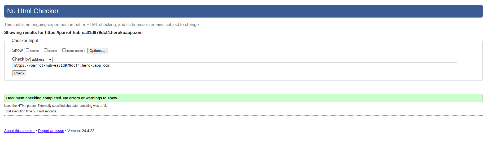

#### individual parrot

https://validator.w3.org/nu/?doc=https%3A%2F%2Fparrot-hub-ea31d979dcf4.herokuapp.com%2Ffischers%2F

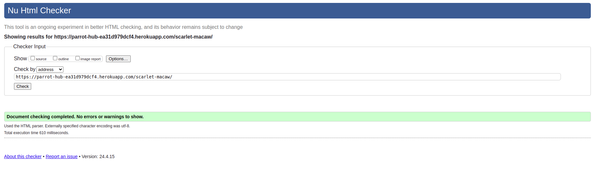

#### Events page
https://validator.w3.org/nu/?doc=https%3A%2F%2Fparrot-hub-ea31d979dcf4.herokuapp.com%2Fevents%2F

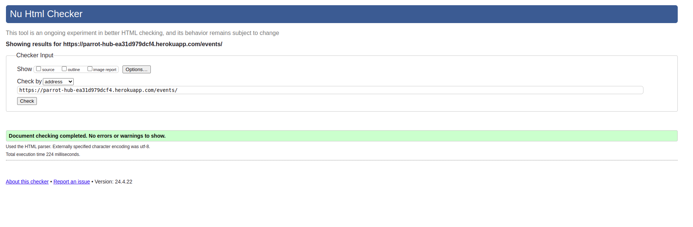

#### Add Event page

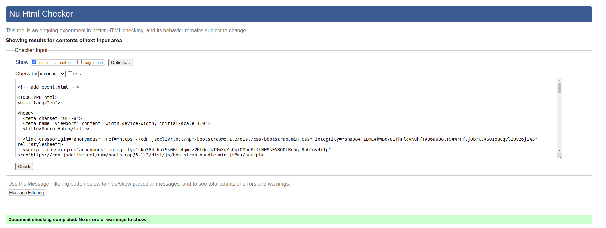

### JavaScript
#### script.js
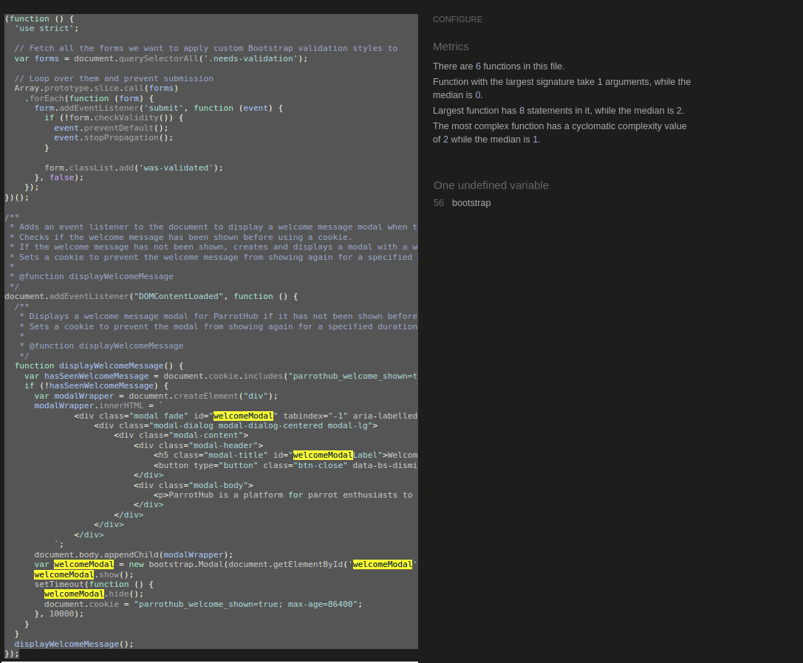

### Python

#### events.model.py
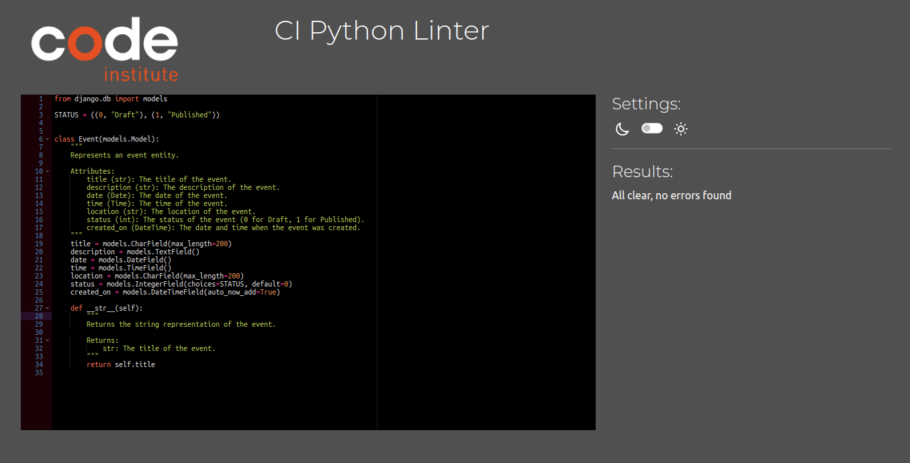

#### events.view.py
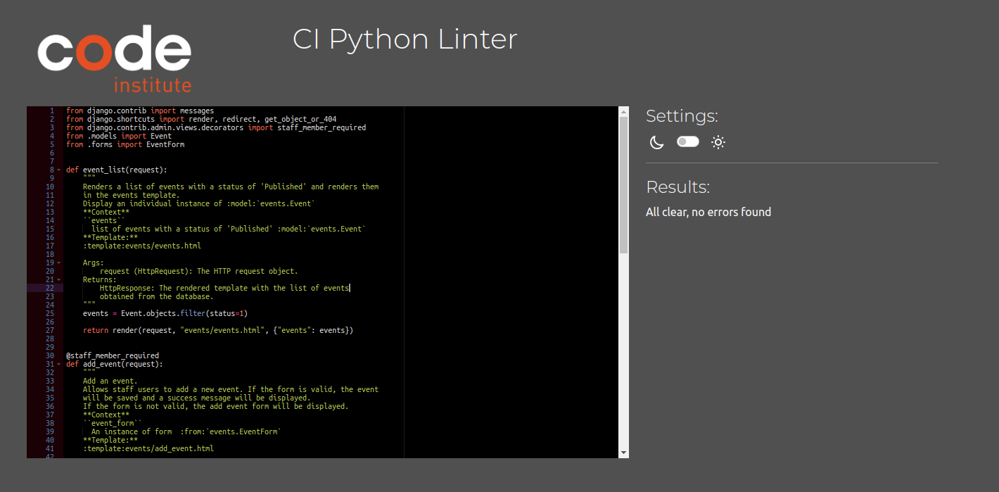

#### parrot.model.py
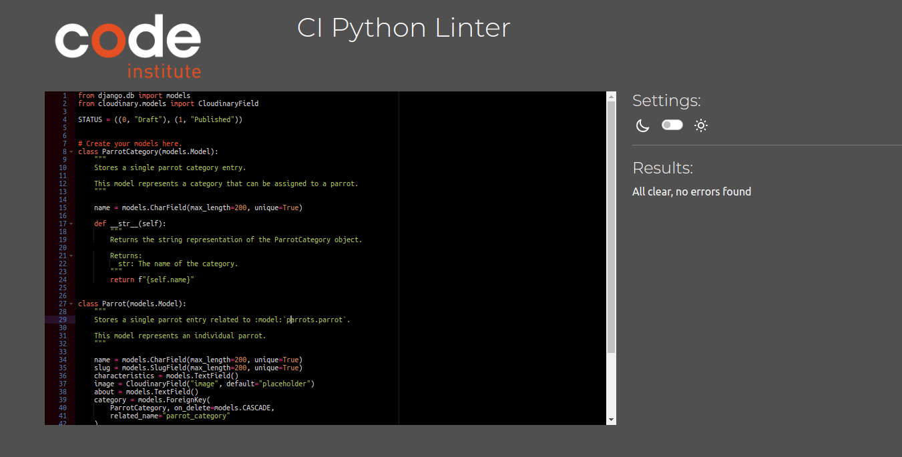

#### parrot.view.py
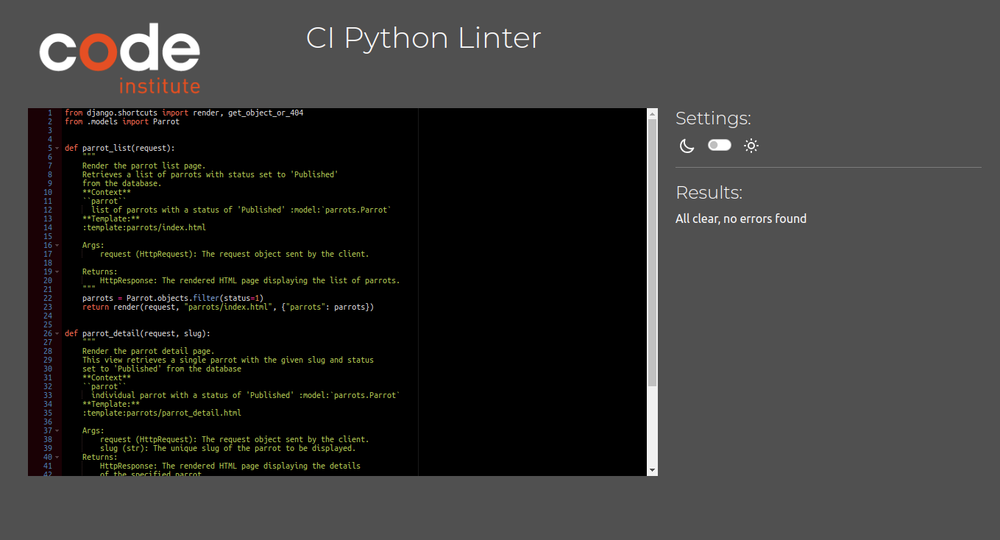

***

## Lighthouse/ Accessibility Testing
With the Lighthouse tests there are some best practices issue. This is because of Cloudinary uses http protocol. HTTPS/HTTP request cause best-practice score low.  
### home
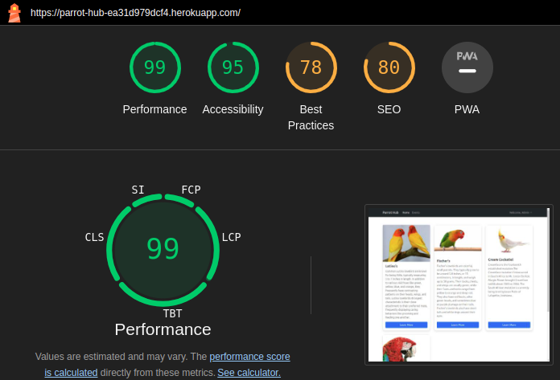

### individual parrot
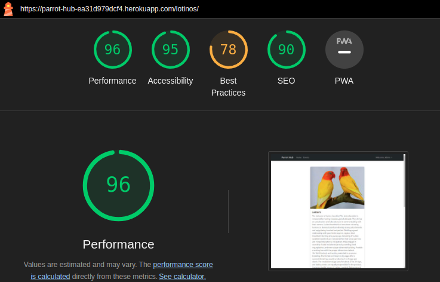

### events
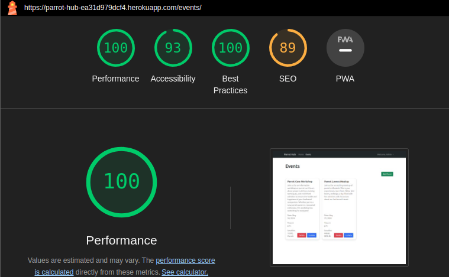

### add events
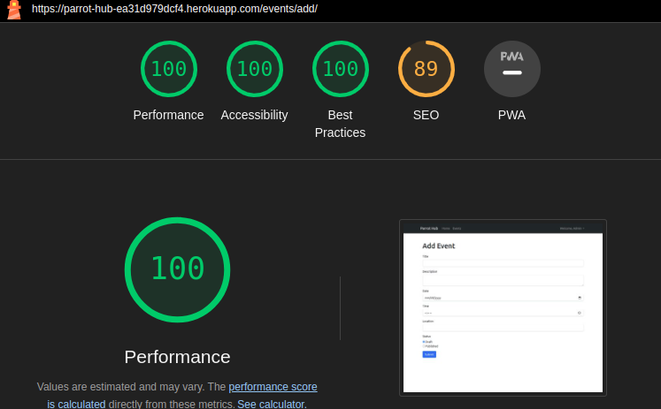

###  signin
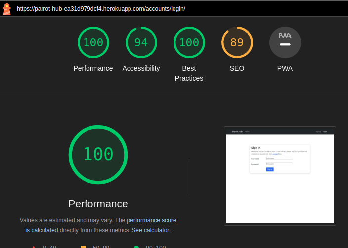

###  signup
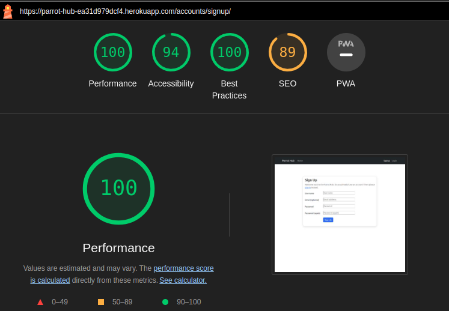

## Devices used for manual testing
Parrothub was tested using the following desktop and mobile browsers:

### Desktop
- Chrome
[<< Back to ReadMe](Readme.md)